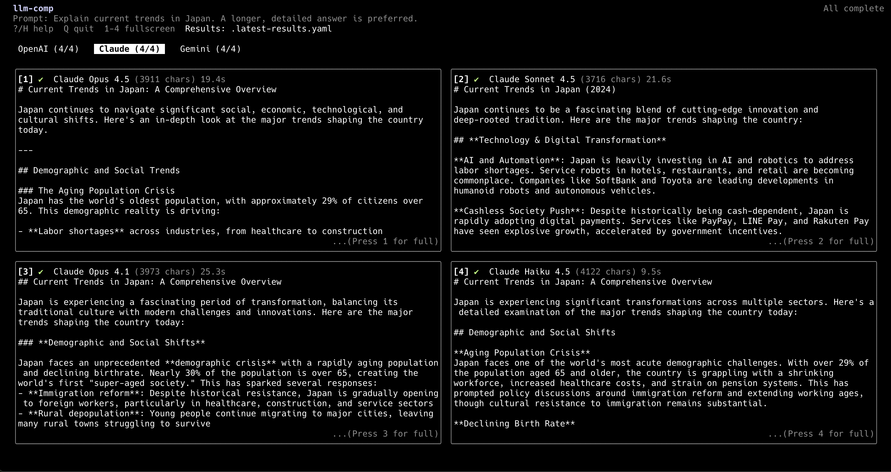
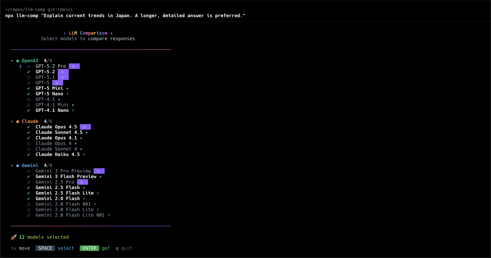

# llm-comp

[](LICENSE)
[](https://nodejs.org/)

Compare LLM responses side-by-side in your terminal.





## Features

- **Interactive model selection** - Arrow keys and space to choose models
- **Multi-model comparison** - Run multiple models in parallel
- **Tabbed response viewer** - Switch between responses with Tab or number keys
- **Selection memory** - Model selections saved for next time
- **Results export** - Responses saved to YAML file
- **Copy to clipboard** - Press `c` to copy current response
- **Terminal resize support** - UI automatically adapts to terminal size
- **Minimal dependencies** - Uses `ink` (React-based TUI) and `yaml`

## Quick Start

```bash
git clone https://github.com/kndoshn/llm-comp.git
cd llm-comp
npm install && npm run build

npx llm-comp init          # Create config files
# Edit .env with your API keys
npx llm-comp "Your prompt"
```

### Prerequisites

- Node.js 20+
- API key for at least one provider:
  - [OpenAI](https://platform.openai.com/api-keys)
  - [Anthropic](https://console.anthropic.com/)
  - [Google AI](https://aistudio.google.com/app/apikey)

### Global Installation (optional)

```bash
npm install -g .
llm-comp "your prompt"
```

## Usage

### Workflow

1. `npx llm-comp "your prompt"` - Run command
2. Use ↑↓ to navigate, Space to toggle - Select models
3. Press Enter, then Y - Confirm
4. Switch tabs to compare - View results

### Keyboard Shortcuts

**Model Selection**

| Key | Action |
|-----|--------|
| `↑` / `↓` | Navigate |
| `Space` | Toggle selection |
| `Enter` | Confirm |
| `q` | Quit |

**Response Viewer**

| Key | Action |
|-----|--------|
| `Tab` / `→` | Next tab |
| `Shift+Tab` / `←` | Previous tab |
| `1`-`4` | Jump to tab |
| `↑` / `↓` | Scroll |
| `PgUp` / `PgDn` | Page scroll |
| `Home` / `End` | Top / Bottom |
| `c` | Copy response |
| `?` / `h` | Help |
| `q` | Quit |

### Piped Input

```bash
echo "Explain this code" | npx llm-comp
cat prompt.txt | npx llm-comp
```

### JSON Output

Set `ui.mode: "json"` in config or pipe output:

```bash
npx llm-comp "prompt" | jq '.[] | select(.kind == "success")'
```

## Configuration

### Initialize

```bash
npx llm-comp init
```

Creates:
- `llm-comp.yaml` - Configuration (local-only, gitignored)
- `.env` - API keys (auto-loaded, gitignored)

### Config File Locations

Searched in order:
1. `./llm-comp.yaml` (current directory)
2. `~/.config/llm-comp/config.yaml` (global)

### Example Config

See `llm-comp.example.yaml` for a shareable template.

```yaml
app:
  title: "llm-comp"
  system: |
    You are a helpful assistant.
  timeout_ms: 60000

providers:
  openai:
    enabled: true
    model: ["gpt-5-nano", "gpt-4.1-nano"]  # Fallback order
    temperature: 0.2
    max_output_tokens: 800

  claude:
    enabled: true
    model: ["claude-haiku-4-5-20251001"]
    temperature: 0.2
    max_output_tokens: 800

  gemini:
    enabled: true
    model: ["gemini-2.5-flash-lite"]
    temperature: 0.2
    max_output_tokens: 800

ui:
  mode: "tabbed"  # "tabbed" or "json"
```

## Available Models

See [MODEL_CATALOG.md](MODEL_CATALOG.md) for the full list.

### OpenAI

| Model | Tier | Description |
|-------|------|-------------|
| `gpt-5.2-pro` | Flagship | Most capable |
| `gpt-5.2` | Flagship | Latest flagship |
| `gpt-5-mini` | Standard | Balanced |
| `gpt-5-nano` | Fast | Cost-efficient |
| `gpt-4.1` | Standard | Reliable |
| `gpt-4.1-nano` | Fast | Fastest |

### Claude

| Model | Tier | Description |
|-------|------|-------------|
| `claude-opus-4-5-20251101` | Flagship | Most capable |
| `claude-sonnet-4-5-20250929` | Standard | Balanced |
| `claude-haiku-4-5-20251001` | Fast | Fastest |

### Gemini

| Model | Tier | Description |
|-------|------|-------------|
| `gemini-2.5-pro` | Flagship | Most capable |
| `gemini-2.5-flash` | Standard | Balanced |
| `gemini-2.0-flash` | Fast | Fast multimodal |
| `gemini-2.0-flash-lite` | Fast | Cost-efficient |

## Persistence

| File | Purpose |
|------|---------|
| `.llm-comp-selection.json` | Saved model selections |
| `.latest-results.yaml` | Last run results |

Both files are gitignored.

## Environment Variables

| Variable | Description |
|----------|-------------|
| `OPENAI_API_KEY` | OpenAI API key |
| `ANTHROPIC_API_KEY` | Anthropic API key |
| `GEMINI_API_KEY` | Google AI API key |
| `LLM_COMP_SKIP_DOTENV` | Set to `1` to skip `.env` loading |

## Troubleshooting

| Problem | Solution |
|---------|----------|
| Provider not showing | Add API key to `.env` |
| Model not found | Add fallback models: `model: ["preferred", "fallback"]` |
| Shift+Tab not working | Use `←` instead |
| Timeout | Increase `app.timeout_ms` in config |
| "Terminal too small" | Resize terminal to at least 60x20 |

## Contributing

See [CONTRIBUTING.md](CONTRIBUTING.md) for development setup and guidelines.

## License

MIT
